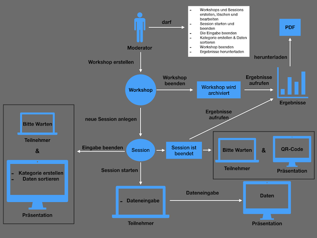

# Workshoppy-Projekt
Bei diesem Projekt handelt es sich um eine Bachelorarbeit von Herr Alongkorn Kiatmontri, welche am 28.08.2019 zur Erlangung des akademischen Grades Bachelor of Science an der HTW Berlin vorgelegt wurde.

## Kurzfassung des Projektes
Ziel dieser Bachelorarbeit ist es, eine Webanwendung zu entwickeln, über welche Workshops in Echtzeit durchgeführt werden können. Dazu werden Workshops angelegt und in einer Datenbank gespeichert. Das Erarbeiten von Ergebnissen erfolgt in einer Sitzung, welche ebenfalls in einer Datenbank gespeichert werden. Mit Hilfe des WebSockets und des Web Application Messaging Protocols soll die Datenübermittlung von mehreren Personen in Echtzeit geprüft werden. Das Hauptaugenmerk dieser Arbeit wird auf die Datenausgabe von mehreren Personen in Echtzeit und die digitale Datenzusammenfassung gelegt. Der Beamer wird dabei als Ausgabemedium verwendet. Außerdem passt sich diese Anwendung automatisch an die Auflösung und Darstellung des jeweiligen Endgerätes (Smartphone, Tablet und PC) an. 

## Funktionsweise der Webanwendung

* Nach der erfolgreichen Anmeldung wird der Nutzer, der für die Durchführung des Workshops verantwortlich ist, auf die **Hauptseite** der Webanwendung weitergeleitet. Im Bereich „Workshop-Liste” werden die erstellten Workshops aufgelistet. Mit dem „Workshop erstellen”-Button kann ein neuer Workshop erstellt werden. Durch das Anklicken des Edit- sowie Löschen-Buttons kann der einzelne Workshop gezielt bearbeitet und gelöscht werden. Die beendeten Workshops werden im Bereich „Beendete Workshops” archiviert. Der Ergebnisse-Button führt zur der Ergebnisse-Seite des archivierten Workshops.

* Jeder Workshop hat seine eigene **Controller-Seite**.
  * Das Navigation-Tab „WS-Controller” beinhaltet vier folgende Buttons: 
    * Client-Button: öffnet die Teilnehmer-Seite als neues Browser-Tab. Auf dieser Seite können die Teilnehmer die Dateneingabe tätigen. 
    
    **Anmerkung**: Der Client-Button wird in der zukünftigen Weiterentwicklung entfernt, da der Moderator nicht für die Dateneingabe beteiligt werden darf. Für diese Arbeit wird der Client-Button aufgrund des Funktionstests erstmal erhalten bleiben.
    
    * Präsentation-Button: öffnet als neues Browser-Fenster die Präsentation-Seite. Mittels Beamer präsentiert sie den Teilnehmern die eingegebenen Daten in Echtzeit.
  
    * Ergebnisse-Button: öffnet ein neues Browser-Tab und ruft die Ergebnisse-Seite auf. Die Zwischenergebnisse des Workshops werden dargestellt. Der Ergebnisse-Button ist erst aktiviert, wenn die Ergebnisse vorhanden sind.
  
    * Beenden-Button: beendet den laufenden Workshop und leitet den Moderator zur Hauptseite weiter. Der Workshop wird anschließend in „Beendete Workshops” archiviert.

  * Die Agenda, falls sie vorhanden ist, wird im Navigation-Tab „Agenda” dargestellt.
  * Neben dem Einscannen des QR-Codes auf der Präsentation-Seite können die Teilnehmer im Navigation-Tab „Teilnehmer” die Einladung per Mail senden lassen, um am Workshop teilzunehmen.
  * Das Brainstorming wird in der Session-Liste durchgeführt. Zunächst muss der Moderator mit dem „Session-Erstellen-Button” eine neue Session anlegen. 
  * Die behandelte Frage, die auf der Teilnehmer- und Präsentation-Seite zu sehen sein wird, muss definiert werden. Als Option kann der Titel der Session angegeben werden. Wie viele Sessions in einem Workshop benötigt werden, das entscheidet der Moderator selbst. Er kann unbegrenzt viele Sessions erstellen.
  * Neben jeder Session sind drei Buttons zu sehen. 
    * Edit-Button: Mit diesem Button kann die Titel- sowie Fragenänderung durchgeführt werden.
    * Löschen-Button: Der Löschen-Button löscht die Session inklusive ihrer zugehörigen Daten.
    * Starten-Button: Es wird erst „gebrainstormt”, wenn die Session gestartet ist. Während die Session läuft, darf sie nicht bearbeitet und gelöscht werden. Alle Buttons von nicht aktiven Sessions werden auch in dieser Phase deaktiviert. Es kann nur eine Session gestartet werden. Außerdem kann der Workshop bei laufender Session nicht beendet werden. Der „Beenden-Button” in WS-Controller wird ebenfalls auch deaktiviert.
    
    **Anmerkung**: Es gibt zusätzlich noch zwei weiteren Buttons, welche erst sichtbar werden, wenn eine Session gerade läuft. Das ist der „Eingabe beenden”- und Session „Beenden”-Button.
    
    * Der „Eingabe beenden-Button” stoppt die Eingabe auf der Teilnehmer-Seite. Demzufolge können die Teilnehmer keine weiteren Daten mehr eingeben. Der „Session Beenden-Button” beendet die gerade laufende Session. Auf der Teilnehmer-Seite wird durch den Klick auf dem „Session Beenden-Button” der Infotext „Bitte Warten” angezeigt und gleichzeitig wird der QR-Code zur Teilnahme am Workshop auf der Präsentation-Seite dargestellt.
    
    * Erst nach dem Beenden der laufenden Session werden alle zuvor deaktivierten Buttons wieder reaktiviert.
    
* Um auf die **Teilnehmer-Seite** zu kommen, müssen die Teilnehmer des Workshops den QR-Code, welche auf der Präsentation-Seite (Beamer) zu sehen ist, einscannen oder sie lassen sich per Mail die Einladung zur Teilnahme am Workshop zusenden. Die Teilnehmer-Seite stellt jedem Workshop-Teilnehmer die Dateneingabefunktion zu einer gestarteten Session bereit. Beim Aufrufen der Seite werden die Teilnehmer zunächst aufgefordert, ihren Benutzernamen einzugeben.

* Nach Eingabe Ihres Benutzernamens werden die Teilnehmer auf die Eingabefunktion weitergeleitet. Erst wenn der Moderator eine Session startet, können die Teilnehmer die Dateneingabe tätigen.

* Die **Präsentation-Seite** dient der Darstellung der Dateneingabe von allen Teilnehmern in Echtzeit. Die Seite hat zwei Zustände, nämlich passiv und aktiv.

  * **passiver Zustand**:
Dieser Zustand bedeutet, dass momentan keine Session läuft. Die Präsentation-Seite zeigt bei diesem Zustand den QR-Code zur Teilnahme am Workshop an. Bevor die Session tatsächlich beginnt, können die Teilnehmer den QR-Code über Ihre Mobilgeräte einscannen, um am Workshop teilzunehmen.

  
